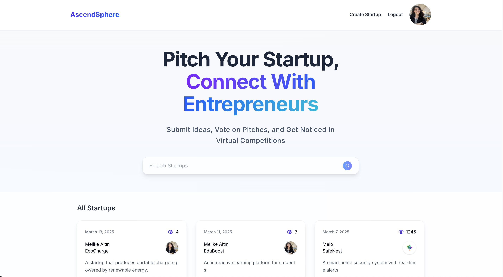
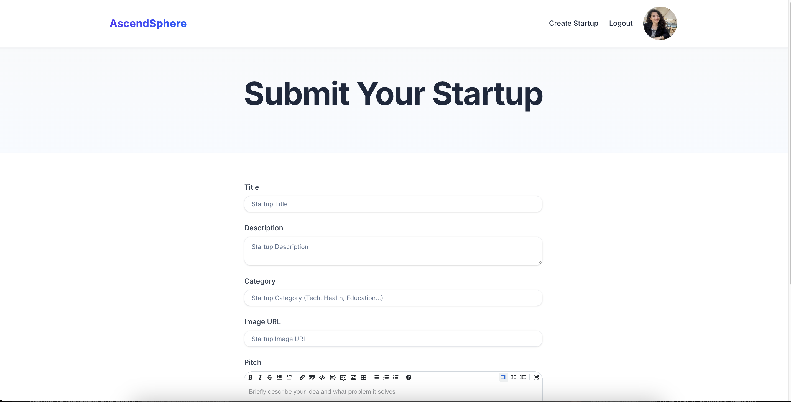
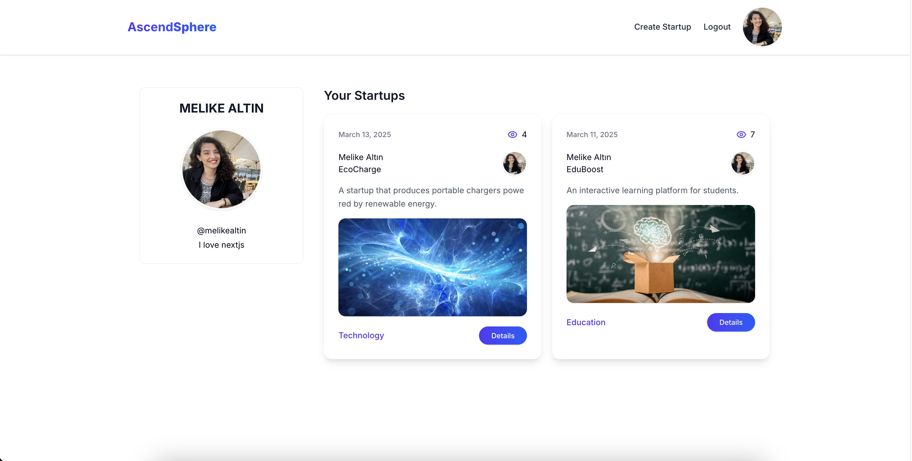
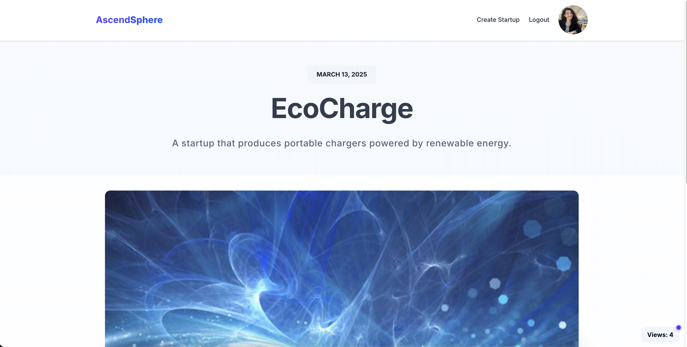

# AscendSphere

A modern startup ecosystem designed for entrepreneurs to showcase, share, and grow their projects with a dynamic and interactive experience.

## Table of Contents

- [Overview](#overview)
- [Screenshot](#screenshot)
- [Features](#features)
- [Technology Stack](#technology-stack)

## Overview

AscendSphere provides a powerful platform for entrepreneurs to present their startups, share detailed pitches, and connect with like-minded founders. With Next.js 15 and Sanity CMS, it delivers high performance and scalability.

## Screenshots

## Features

- **Dynamic Startup Profiles** – Custom profile pages for each startup
- **Real-Time Views** – Track startup popularity with live analytics
- **User Profiles** – Manage detailed user profiles and portfolios
- **Categorized Search** – Advanced filtering and search capabilities
- **Responsive Design** – Optimized for all screen sizes
- **SEO Optimization** – Enhanced structure for better visibility

## Technology Stack

🛠️ **Built with:**

- **Next.js 15** – Frontend framework
- **TypeScript** – Type safety and scalability
- **Tailwind CSS** – Styling and responsive design
- **Sanity CMS** – Content management system
- **Shadcn/ui** – Modern UI components
- **NextAuth.js** – Secure authentication
